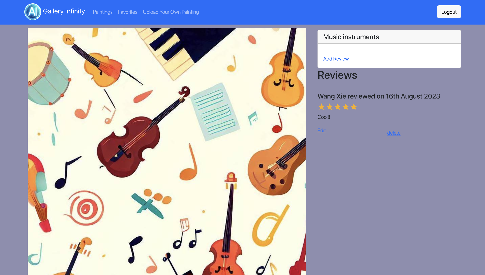

# WangXie-finalproject-frontend

Team member: Wang Xie (one person project)

Iteration 1:

I have used my own MERN stack project code as the starter code. I Have added the "Upload.js" and "upload.css" to components. They are supposed to contain functionalities of the upload page where user can upload their own AI generated paintings to the site. The functionalities are not implemented yet. I have also added "upload.js" to services. It will contain the data service for the upload action. Its functionality is not implemented yet.

I have added the links to the upload page to App.js, so when the user log in, the user should be able to see the "Upload your own painting" link that links to the upload page.

Some of the file names and variable names has not yet been changed from the starter code. This does not affect the actual functionality because the nescessay changes of names have been made for code consistency. Those file names and variable names yet to be changed will be changed in the next iteration.

I have chose to use Google Cloud Storage for the image upload functionality. During the iteration 1, I have read the documentation of how to upload images with Google Cloud Storage. In later iterations, I will implement the functionality that will use the Google Cloud Storage to assign uploaded image an URL and use that URL as the mean of image retrieval. 

So at the moment, after you log in you should see the following:

At the current moment all functionalities that the MERN project has should also be available on this gallery project. For example, clicking on the star to mark favorite, or posting a review, or go to the favorite page and drag and drop the favorites into a new order. 

Iteration 2:

Have implemented both front and back end of the functionality of uploading an image from the client's side and then uploading the image to google cloud storage which gives a URL associated to the image, and then updating the database with the new URL. 

Please note that at the current stage, the upload page does not update after successfully updated. This will be changed in the next iteration.

The front end uploading form:

The new image added:

Iteration 3:

I have implemented the rating system for the reviews with the 3rd party library Material UI for React. 
The website for the 3rd party library is the following: https://mui.com/material-ui/react-rating/ 

The implementation of the 3rd party library is in AddReview.js. The following image is what the rating system looks like in practice.

I have also implemented a new Bootstrap UI component Toast in Upload.js. Toast is used to send user a toast when the user clicked upload when no image is uploaded. When user successfully upload an image, another toast will show up saying "success", and the input container will be cleared so that the user could upload a new one. 

The following are pictures of how toast works in practice.

I also changed into a new logo image, which is generated with Bing's AI chatbot.

